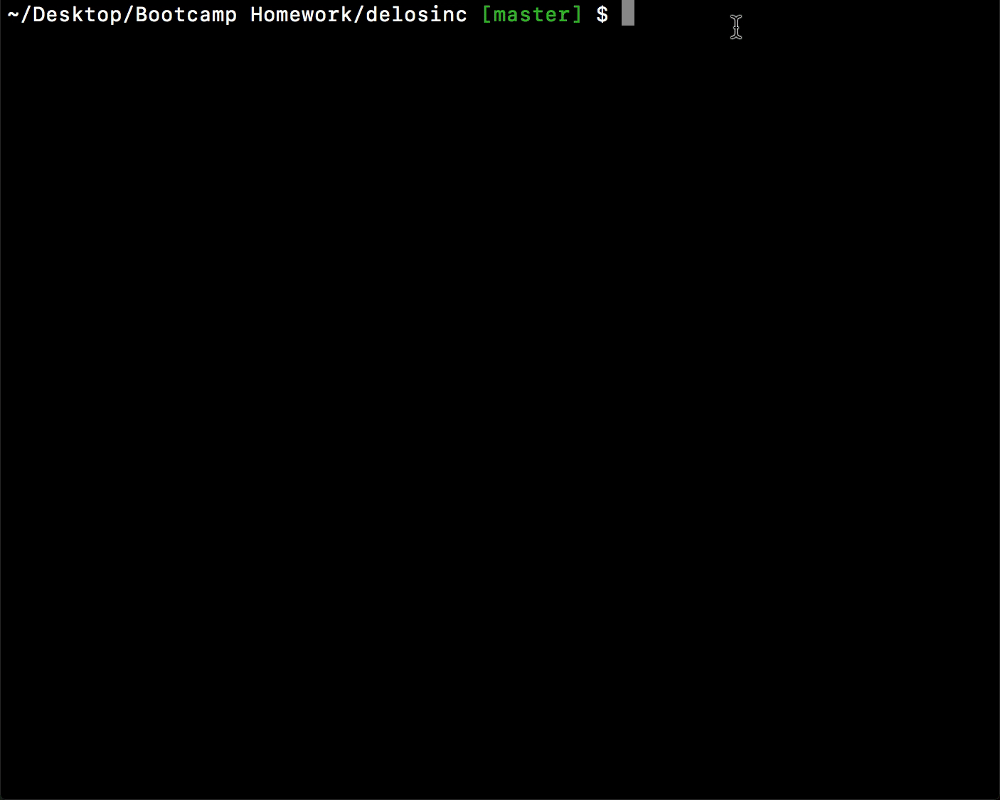

# Delos Inc. System Databse Tool :robot: 
These violent delights have violent ends 

Welcome to Delos Destinations. In this command line app built with Node, guests as well as administrators have access to various tools that interact with Delos' MySQL database. Guest are able to purchase narrative slots to play through inside one of our six parks. 

Admin and Director level tools are restricted and require proper credentials to access.

## Getting Started :floppy_disk:

### Prerequisites :open_file_folder:
Make sure you have node.js installed on your computer! You can download it via the installer on the official site
```
https://nodejs.org/en/download/
```

Then either clone or download this repo.

### Installation :file_folder:
Inside your terminal or command prompt, navigate to the location of the cloned repo. Install the necessary dependencies by running - 
```
npm i
```

### MySQL :dolphin:
You will also need an IDE for MySQL to create the `delos_DB` database. I recommend [`mySQL Workbench`](https://www.mysql.com/products/workbench/). 

Either open the file
```
park_data.sql
```
inside of your preferred IDE or copy its content and then execute the database.

If you've setup your connection differently or created a new one, make sure to change the information inside `delosinc.js` to match your connection information on lines 6-9.
```javascript
var connection = mysql.createConnection({
	host:"localhost",
	port: 3306,
	user: "root",
	password: "password",
	database: "delos_DB"
});
```

## Using the App :computer:

Type `node delosinc.js` into your terminal to begin using the app. You can navigate through the commands using the up and down arrows and hitting enter. 

To exit the app either hold down `control + c` or select the last command `Exit`

### Guest Level Access :telephone:


To enter Guest Access select `guest` from the main commands menu. Type in any desired password to view a table of all available narratives and to purchase slots.

### Admin Level Access :satellite:

To enter Admin Access select `admin` from the main commands menu. The password to gain access is `violentdelights`

Once inside of the Admin Panel you can view all current narratives, create new narratives, or add additonal slots to a select narrative.

### Director Level Access :no_entry_sign:

To enter Director Access select `director` from the main commands menu. The password for director access is `violentends`

Inside the Director Panel you can view the company's profits and overheard park costs. You can also create a new Park *pending approval from the board*

Create new hosts by selecting the last op ̵͈̭̠̃͂̔ͅH̸͇̻͚̜̦͗̀͒́o̶̹̣͓͊s̷̢̰̲̳͉̿̎͋t̸̪̼͎͌̆̉̍͝ş̷̬̹̬̿̓̽͊́ ̸͉͔̍̋͗͛w̸͈̌̔̃į̶͂̄́̎l̸̖̯͍̖̇̿ͅl̵̡̲̼͍̜̆̇̋͐ ̷̤̭̥̌ț̵͍̲́̀̓̂̕ͅh̷̞̳͍̾̑̀̓e̶̤̩͖͠s̸̯̓͊̿ḛ̶̛͚̈͌ ̸̯̳̲̯͙́͋̐͆͠v̸̮̰̀͝ͅį̷̠̺͉̻̍o̵̫͔̲̺̓͂̏̐̚l̶̛̼̘͋̈̇é̴͕͎̂͂͠ṇ̵͍͇̋̆̔t̶̩͋͋̌͂͒ ̸͎̗͖̬̹͛͛̓̉d̵̗̈́̇͒͆͘ͅȩ̶̣̩̾̐ḷ̶̮̙̈́͘i̴̛̮̅͝g̸̢̛͖͉̪̦h̷̼̩̜͝t̵̠̗̿͝ŝ̵̗̦̤̣̄̚ ̶̞̋̃̓͆h̷͖̺͓͊͂̇͝ͅͅã̴̬̯̎͛̚͝v̷͕̕ḙ̴̔͂͂ ̵̦̹͚̳͚͌́́̀̅v̵͚̳̊i̴̮̘͔̗̹̍́̊o̵̳͚͕̞̿͋́͝l̸̛̟̬͎̩̏͝e̸̳̓͆̈́n̸̬̰̅́t̸̨̺͒ ̶̧̢̯̜̇̈ȩ̷͛͂͐̅n̶̗̖͎̫͝ͅd̴̪̑̓̎ŝ̷̮͇͝.̵̠̜͉̞͔̂͂̑̊̀


## Built With :cd:
* [Javascript](https://www.javascript.com/) - programming language
* [Node.js](https://nodejs.org/en/) - javascript runtime
* [mySQL](https://www.mysql.com/) - database

### NPM Packages
* [mySQL](https://www.npmjs.com/package/mysql)
* [inquirer](https://www.npmjs.com/package/inquirer)
* [CLI Table](https://www.npmjs.com/package/cli-table)

## Author :key:
* **Jimmy Tu** - [jimmytutron](https://github.com/jimmytutron)


## Acknowledgments :pray:
A big thank you to our instructor, Jerome, and the TAs, Amber, Ricky, and Sasha!!  :grimacing:
and to HBO and WestWorld. I was binging season 2 and got inspired.
